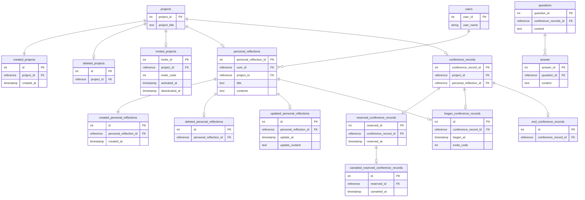

# DB 設計

---

```mermaid
erDiagram
    users {
        int user_id PK
        string user_name
    }
    projects{
        int project_id PK
        text project_title
    }
    created_projects{
        int id PK
        reference project_id FK
        timestamp created_at
    }
    deleted_projects{
        int id PK
        referece project_id FK
    }

    invited_projects{
        int invite_id PK
        reference project_id FK
        int invite_code
        timestamp activated_at
        timestamp deactivated_at
    }

    personal_reflections{
        int personal_reflection_id PK
        reference user_id FK
        reference project_id FK
        text title
        text contents
    }
    created_personal_reflections{
        int id PK
        reference personal_reflection_id FK
        timestamp created_at
    }
    deleted_personal_reflections{
        int id PK
        reference personal_reflection_id FK
    }

    updated_personal_reflections{
        int id PK
        reference personal_reflection_id FK
        timestamp update_at
        text update_content
    }

    conference_records{
        int conference_record_id PK
        reference project_id FK
        reference personal_reflection_id FK
    }
    reserved_conference_records{
        int reserved_id PK
        reference conference_record_id FK
        timestamp reserved_at
    }
    canseled_reserved_conference_records{
            int id PK
            reference reserved_id FK
            timestamp canseled_at
        }

    began_conference_records{
        int id PK
        reference conference_record_id FK
        timestamp began_at
        int invite_code
    }
    end_conference_records{
        int id PK
        reference conference_record_id FK
    }

    questions{
        int question_id PK
        reference conference_records_id FK
        text content
    }
    answer{
        int answer_id PK
        reference question_id FK
        text content
    }

users ||--o{ personal_reflections: ""
projects ||--|| created_projects: ""
projects ||--o| deleted_projects: ""
projects ||--o| invited_projects: ""
projects ||--o| personal_reflections: ""
projects ||--o| conference_records: ""
personal_reflections ||--|| created_personal_reflections: ""
personal_reflections ||--o| deleted_personal_reflections: ""
personal_reflections ||--o| updated_personal_reflections: ""
personal_reflections ||--o| began_conference_records: ""
conference_records ||--o| reserved_conference_records: ""
conference_records ||--o| began_conference_records: ""
conference_records ||--o| end_conference_records: ""
reserved_conference_records ||--o| canseled_reserved_conference_records: ""
questions ||--o{ answer: ""


```

---
