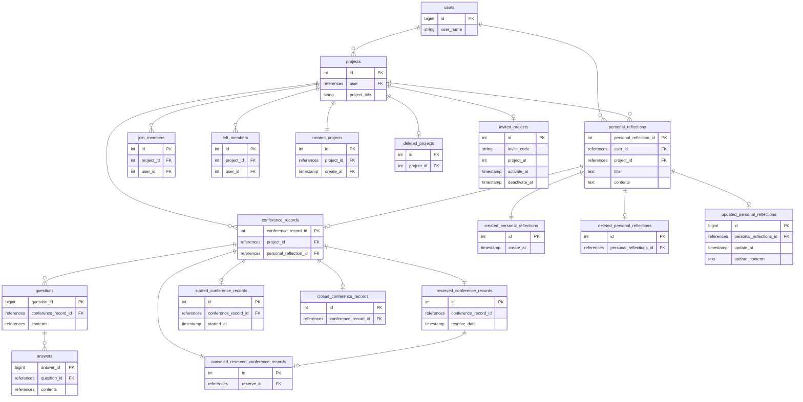

# DB 設計

---

```mermaid
erDiagram
users ||--o{ personal_reflections: ""
users ||--o{ projects: ""
projects ||--o{ conference_records: ""
projects ||--o{ join_members: ""
projects ||--o{ left_members: ""
projects ||--o{ personal_reflections: ""
projects ||--|| created_projects: ""
projects ||--o| deleted_projects: ""
projects ||--o| invited_projects: ""
personal_reflections ||--|| created_personal_reflections: ""
personal_reflections ||--o| deleted_personal_reflections: ""
personal_reflections ||--o| updated_personal_reflections: ""
personal_reflections ||--o| conference_records: ""
conference_records ||--o{ questions: ""
conference_records ||--|| reserved_conference_records: ""
conference_records ||--|| canseled_reserved_conference_records: ""
conference_records ||--o| started_conference_records: ""
conference_records ||--o| closed_conference_records: ""
reserved_conference_records ||--o| canseled_reserved_conference_records: ""
questions ||--o{ answers: ""
  users {
    bigint id PK
    string user_name
  }
  projects {
    int id PK
    references user FK
    string project_title
  }
  personal_reflections {
    int personal_reflection_id PK
    references user_id FK
    references project_id FK
    text title
    text contents
  }
  conference_records {
    int conference_record_id PK
    references project_id FK
    references personal_reflection_id FK
  }
  questions {
    bigint question_id PK
    references conference_record_id FK
    references contents
    }
  answers {
    bigint answer_id PK
    references question_id FK
    references contents
  }
  join_members{
    int id PK
    int project_id FK
    int user_id FK
  }
  left_members{
    int id PK
    int project_id FK
    int user_id FK
  }
  created_projects {
    int id PK
    references project_id FK
    timestamp create_at FK
  }
  invited_projects{
    int id PK
    string invite_code
    int project_at
    timestamp activate_at
    timestamp deactivate_at
  }
  deleted_projects{
    int id PK
    int project_id FK
  }
  created_personal_reflections{
    int id PK
    timestamp create_at
  }
  deleted_personal_reflections {
    int id PK
    references personal_reflections_id FK
  }
  updated_personal_reflections {
    bigint id PK
    references personal_reflections_id FK
    timestamp update_at
    text update_contents
  }
  reserved_conference_records{
    int id PK
    references conference_record_id
    timestamp reserve_date
  }
  canseled_reserved_conference_records{
    int id PK
    references reserve_id FK
  }
  started_conference_records{
    int id PK
    references conference_record_id FK
    timestamp started_at
  }
  closed_conference_records{
    int id PK
    references conference_record_id FK
  }
```

---